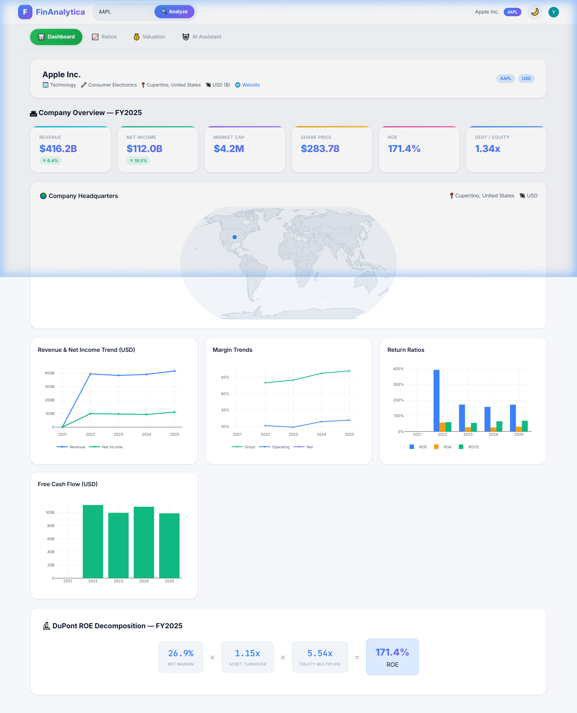
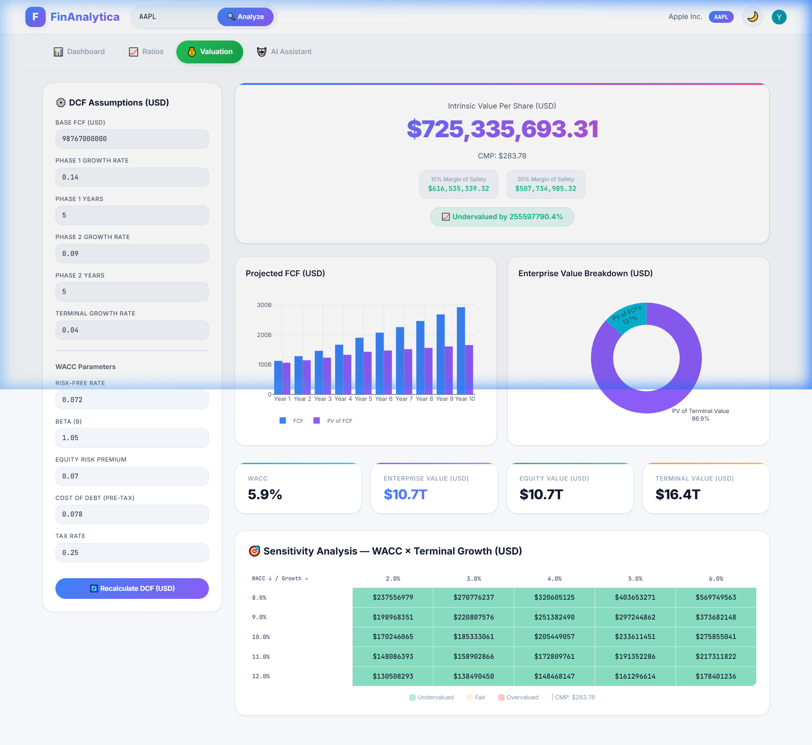

# FinAnalytica

A full-stack **Financial Statement Analysis & Valuation Platform** built with **FastAPI** and **React**. Analyze any publicly listed company by its stock ticker — get 30+ financial ratios, DuPont decomposition, DCF valuation, sensitivity analysis, and AI-powered insights, all in one place.

---

## Screenshots

### Dashboard — Company Overview & Key Metrics


### Valuation — DCF Model, Sensitivity Analysis & Charts


---

## Features

- **Ticker-Based Analysis** — Enter any valid stock ticker symbol (e.g. `RELIANCE.NS`, `AAPL`, `TCS.NS`) to fetch financials via yFinance and run a complete analysis pipeline.
- **CSV Upload** — Upload your own Income Statement, Balance Sheet, and Cash Flow CSVs for custom company analysis.
- **30+ Financial Ratios** — Profitability, Leverage, Liquidity, Efficiency, and Growth ratios computed with CFA-level methodology, along with threshold-based warning flags.
- **DuPont Decomposition** — Multi-year breakdown of Return on Equity into its component drivers.
- **DCF Valuation** — Two-phase Discounted Cash Flow model with WACC computation and intrinsic value per share.
- **Sensitivity Analysis** — Matrix showing how changes in WACC and terminal growth rate impact intrinsic value.
- **AI Financial Assistant** — Chat with an AI analyst (NVIDIA NIM — LLaMA 3.3 70B) that understands your loaded financial data and provides contextual insights.
- **Authentication** — User login/signup powered by Clerk.
- **Interactive Charts** — Financial data visualized with Plotly.js.

---

## Ticker Symbol Usage

> **Important:** This application uses **yFinance** to fetch financial data. You must use valid **ticker symbols** as recognized by Yahoo Finance to look up company details.

| Exchange | Ticker Format | Examples |
|----------|---------------|----------|
| US (NYSE/NASDAQ) | `SYMBOL` | `AAPL`, `MSFT`, `GOOGL`, `TSLA` |
| NSE (India) | `SYMBOL.NS` | `RELIANCE.NS`, `TCS.NS`, `INFY.NS` |
| BSE (India) | `SYMBOL.BO` | `RELIANCE.BO`, `TCS.BO` |
| London | `SYMBOL.L` | `HSBA.L`, `VOD.L` |
| Tokyo | `SYMBOL.T` | `7203.T` (Toyota) |
| Hong Kong | `SYMBOL.HK` | `0005.HK` (HSBC) |

Simply enter the ticker in the search bar and click **Analyze** to fetch and process the company's financial statements.

---

## Tech Stack

| Layer      | Technology                                              |
| ---------- | ------------------------------------------------------- |
| Frontend   | React 18, Vite, Tailwind CSS v4, Plotly.js, Clerk React |
| Backend    | FastAPI, Uvicorn, Pydantic, yFinance, Pandas, NumPy     |
| AI         | NVIDIA NIM API (OpenAI-compatible), LLaMA 3.3 70B      |
| Auth       | Clerk                                                   |

---

## Project Structure

```
FinAnalytica/
├── backend/
│   ├── config/
│   │   └── defaults.yaml          # DCF, WACC & ratio threshold defaults
│   ├── engine/
│   │   ├── ratios.py              # 30+ financial ratio computations
│   │   ├── dupont.py              # DuPont decomposition
│   │   ├── dcf.py                 # Two-phase DCF valuation model
│   │   ├── wacc.py                # WACC calculation
│   │   └── sensitivity.py         # Sensitivity matrix generation
│   ├── ingestion/
│   │   ├── yfinance_fetcher.py    # Fetch data from yFinance API
│   │   └── csv_fetcher.py         # Parse uploaded CSV files
│   ├── models/
│   │   ├── financial_statements.py
│   │   └── analysis_result.py
│   ├── routers/
│   │   ├── analysis.py            # /api/analyze endpoints
│   │   ├── valuation.py           # /api/valuation endpoint
│   │   └── ai_assistant.py        # /api/ai/chat endpoint
│   ├── main.py                    # FastAPI app entry point
│   └── requirements.txt
├── frontend/
│   ├── src/
│   │   ├── pages/
│   │   │   ├── Dashboard.jsx      # Main analysis dashboard
│   │   │   ├── Ratios.jsx         # Financial ratios display
│   │   │   ├── Valuation.jsx      # DCF valuation & sensitivity
│   │   │   └── AIAssistant.jsx    # AI chat interface
│   │   ├── components/
│   │   │   └── AnimatedHeading.jsx
│   │   ├── api/                   # API client utilities
│   │   ├── utils/                 # Helper utilities
│   │   ├── App.jsx                # Root component with routing
│   │   ├── main.jsx               # React entry point
│   │   └── index.css              # Global styles
│   ├── vite.config.js
│   └── package.json
├── assets/                        # Screenshots for README
├── .env                           # API keys (not committed)
└── README.md
```

---

## Prerequisites

- **Python 3.10+**
- **Node.js 18+** and **npm**
- **NVIDIA NIM API Key** — Get one from [NVIDIA NIM](https://build.nvidia.com/)
- **Clerk Account** — Get your publishable key from [Clerk](https://clerk.com/)

---

## Installation

### 1. Clone the Repository

```bash
git clone https://github.com/Pratham-Chavan18/FinAnalytica.git
cd FinAnalytica
```

### 2. Set Up Environment Variables

Create a `.env` file in the project root:

```env
NVIDIA_API_KEY=your_nvidia_api_key_here
VITE_CLERK_PUBLISHABLE_KEY=your_clerk_publishable_key_here
```

Create a `.env` file inside the `frontend/` directory:

```env
VITE_CLERK_PUBLISHABLE_KEY=your_clerk_publishable_key_here
VITE_API_URL=http://127.0.0.1:8001
```

### 3. Backend Setup

```bash
# Create a virtual environment
python -m venv backend/.venv

# Activate it (choose your platform)

# Windows (PowerShell):
.\backend\.venv\Scripts\Activate.ps1

# Windows (CMD):
.\backend\.venv\Scripts\activate.bat

# macOS / Linux:
source backend/.venv/bin/activate

# Install Python dependencies
pip install -r backend/requirements.txt
```

### 4. Frontend Setup

```bash
cd frontend
npm install
```

---

## Running the Project

Open **two separate terminals** from the project root directory:

**Terminal 1 — Start the Backend API Server:**

*Windows (PowerShell / CMD):*
```bash
.\backend\.venv\Scripts\python.exe -m uvicorn backend.main:app --port 8001 --reload
```

*macOS / Linux:*
```bash
backend/.venv/bin/python -m uvicorn backend.main:app --port 8001 --reload
```

**Terminal 2 — Start the Frontend Dev Server:**

```bash
cd frontend
npm run dev
```

### Access the Application

| Service       | URL                            |
| ------------- | ------------------------------ |
| Frontend      | http://localhost:5173           |
| Backend API   | http://127.0.0.1:8001          |
| API Docs      | http://127.0.0.1:8001/docs     |

---

## API Endpoints

| Method | Endpoint                | Description                                      |
| ------ | ----------------------- | ------------------------------------------------ |
| `GET`  | `/api/analyze/{ticker}` | Full analysis for a stock ticker via yFinance     |
| `POST` | `/api/analyze/csv`      | Full analysis from uploaded CSV files             |
| `POST` | `/api/valuation`        | Custom DCF valuation with user-defined assumptions|
| `POST` | `/api/ai/chat`          | Chat with the AI Financial Assistant              |
| `GET`  | `/api/health`           | Health check                                      |

---

## Configuration

Default DCF assumptions, WACC parameters, and ratio warning thresholds are defined in `backend/config/defaults.yaml`. You can modify these to suit different markets or companies.

---

## License

This project is open source and available under the [MIT License](LICENSE).